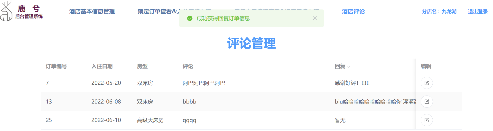

# hotel_reservation酒店预订系统

# 中文
## 项目设置
```
npm install
```

### 为开发编译和热重载
```
npm run serve
```

### 编译和生成
```
npm run build
```

### 自定义配置
See [Configuration Reference](https://cli.vuejs.org/config/).

## 介绍

我们开发了自己的鹿兮连锁酒店预定/入住管理系 统，在Web 端分别向顾客和酒店提供管理服务。对于顾客来说，能够通过我们 的系统了解某地可用酒店、房间及服务情况，经过注册登录从而进行预定、查 看订单、订单评论等操作。对于酒店来说，经过加盟入驻后，通过该系统能够编辑酒店房型基本信息，了解当前可用房间和订单等信息，并能实现入住、退房以及评论回复等功能。以此提高酒店管理水平并优化顾客体验，从而提高酒 店竞争力。

## 功能需求
1.  用户登录：根据用户手机号和密码登录。 
2.  用户注册&实名认证：该阶段要求用户填写姓名、性别、身份证号码、手机 号、用户昵称等信息。
3.  酒店入驻平台：在首页点击“加盟入驻”，进入界面点击“加入我们”进入加盟 界面，在加盟界面选择该连锁酒店XX分店所在省份/城市，填写酒店分店名。
4.  酒店账号登录：点击首页上方的“管理平台按钮”，使用分配的酒店账号 id 和 注册时填写的密码进行登录。
5.  酒店信息管理：酒店方可以填写、修改、删除部分酒店信息。
6.  酒店房型信息管理： 
  1）  增加房型，点击添加按钮，添加房型的各类信息；
  2）  查看已有房型，修改房型信息；
  3）  查看已有房型，点击修改，点击弹出的删除按钮删除某房型；
7.  增加房型：填入房型、房间数量、房间号、图片等。
8.  用户搜索酒店：用户可以在首页酒店搜索栏内搜索酒店名称关键词进行搜索。
9.  房型详情页：详情页内显示该房型的基本信息(含可预定房型间数、房间图 片、价格、网络、早餐服务等)，以及该酒店的基本信息(位置、详细地址、 简介等)。
10.  用户预定房型：在房型详情页点击预定，后台校验此时此刻是否还有空房。
11.  用户个人中心：用户可以进入“个人中心”，在个人中心内查看自己预定记 录。每条预定记录显示下单时间、订单状态、订单号、订单总金额、预定入 住酒店、房间类型、预定间数。
12.  酒店查看预定、入住退房办理：酒店方可以根据日期、预定用户姓名、手机号、身份证号等方式筛选预定信息，查看当前预定信息。
13.  酒店办理入住手续：酒店前台先在系统中输入入住时间等查看预定信息，系统显示办理入住可用订单，点击办理入住，选择可用房间号；
14.  酒店查看房间占用和退房手续办理：酒店方可以点击“房间占用情况查看& 退房手续办理”按钮查看当前酒店所有房间状态
15.  酒店房间状态：酒店可以查看当天所有房间的状态(如空闲、占用等)。 
16.  酒店回复评论：酒店方可以点击酒店评论按钮进入评论界面，在该界面查看 顾客的评论，通过点击对应评论的编辑按钮，在弹出会话框内进行回复。
17.  数据库更新：数据库可以为酒店自动根据时间更新订单状态。

## 前端 & 后端
前端：本项目前端采用 vue.js 框架进行实现。

后端：作为服务端，使用Springboot框架。

## 项目结构


## 部分页面展示

__酒店首页1：__


__酒店首页2-酒店检索：__


__顾客登录：__


__加盟首页：__


__酒店方登录页面：__


__酒店方房型修改：__


__酒店方评论管理：__



# English
## Project setup
```
npm install
```

### Compiles and hot-reloads for development
```
npm run serve
```

### Compiles and minifies for production
```
npm run build
```

### Customize configuration
See [Configuration Reference](https://cli.vuejs.org/config/).

## Introduction

We have developed our own reservation/check-in management system for the Ruoxi hotel chain, which provides management services to customers and hotels respectively on the Web. For customers, they can use our system to learn about available hotels, rooms and services in a particular location, register and log in to make reservations, view orders, and comment on orders. For hotels, after joining the system, they can edit the basic information of hotel room type, know the current available rooms and orders, and realize the functions of check-in, check-out and reply to comments. This will improve the hotel management and optimize the customer experience, thus improving the competitiveness of the hotel.

## Functional requirements
1.  User Login: Login according to user's cell phone number and password.
2.  user registration & real name authentication: this stage requires the user to fill in name, gender, ID number, cell phone number, user nickname and other information. 
3.  Hotel stationing platform: click "Join" on the home page, enter the interface click "Join Us" to enter the join interface, select the hotel chain XX branch in the province / city, fill in the hotel branch name.
4.  hotel account login: click the "management platform button" at the top of the home page, use the assigned hotel account id and the password filled in during registration to login.
5.  Hotel information management: The hotel party can fill in, modify and delete part of the hotel information. 
6.  Hotel room type information management. 
  1） Add room type, click Add button to add various information of room type.
  2） View existing room type and modify the room type information.
  3） View existing room type, click Modify, click the Delete button to delete a room type.
7.  add room type: fill in the room type, number of rooms, room number, picture, etc.
8.  User search hotel: users can search hotel name keyword in the hotel search bar on the home page to search.
9.  room details page: the details page shows the basic information of the room type (including the number of bookable rooms, room pictures, price, network, breakfast service, etc.) and the basic information of the hotel (location, detailed address, introduction, etc.). 
10.  user reservation: click on the reservation in the room details page, and the background checks whether there is still availability at this moment. 11.  user personal center: the user can click on the room details page and check whether the room is available at this moment.
11.  User Personal Center: Users can enter "Personal Center" and view their reservation records in the Personal Center. Each reservation record shows the time of order, order status, order number, total order amount, hotel, room type, and number of rooms reserved. 
12.  Hotel check-in and check-out: The hotel can filter the reservation information according to date, reservation user name, cell phone number, ID card number, etc. and check the current reservation information.
13.  hotel check-in procedures: the hotel receptionist first enter the check-in time in the system, etc. to view the reservation information, the system displays the available orders for check-in, click check-in and select the available room number.
14.  Hotel view room occupancy and check-out procedures: the hotel party can click the "Room Occupancy View & Check-out Procedures" button to view the current status of all rooms in the hotel
15.  hotel room status: the hotel can view the status of all rooms (such as vacant, occupied, etc.). 
16.  hotel reply comments: the hotel party can click the hotel comment button to enter the comment interface, in the interface to view the customer's comments, by clicking the corresponding comment edit button, in the pop-up session box to reply. 
17.  database update: the database can be updated automatically for the hotel according to the time order status.

## Front-end & Back-end
Front-end: The front-end of this project is implemented using the vue.js framework.

Backend: as a server side, using Springboot framework.

## Project structure


## Page presentation

__Hotel Home1:__


__Hotel Home 2-Hotel Search:__


__Customer login:__


__Join Home:__


__Hotel party login page:__


__Hotel party room type modification:__


__Hotel-side comment management:__
